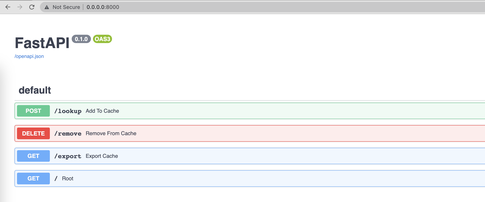
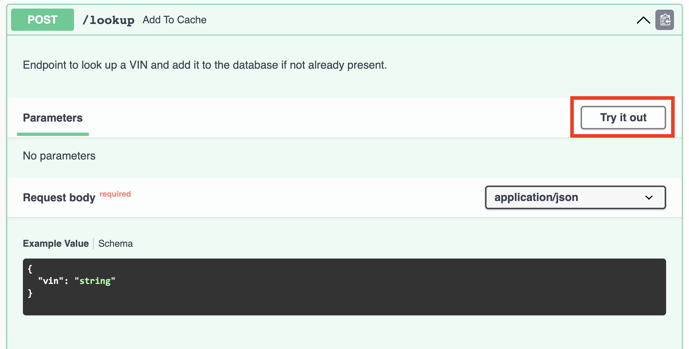
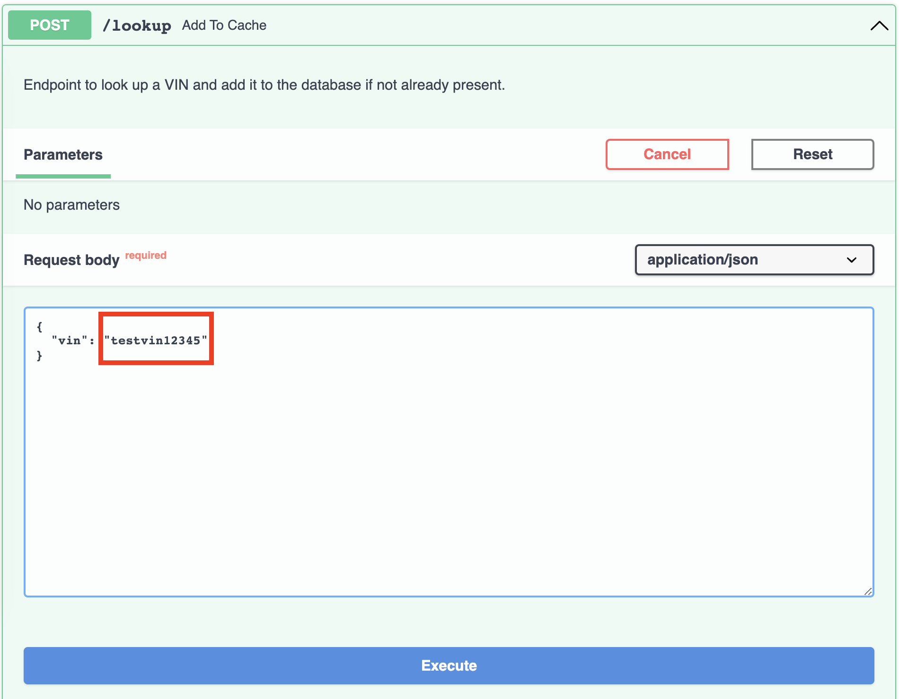
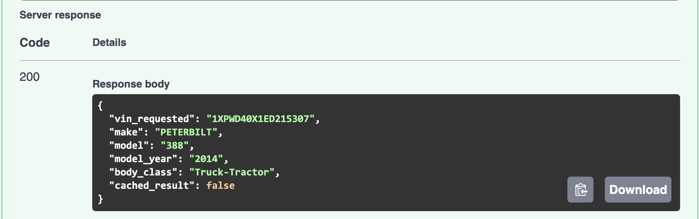
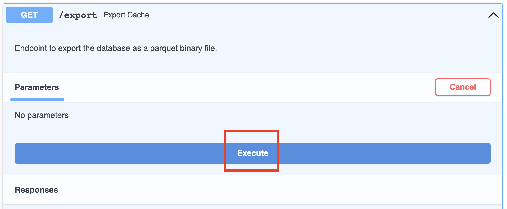
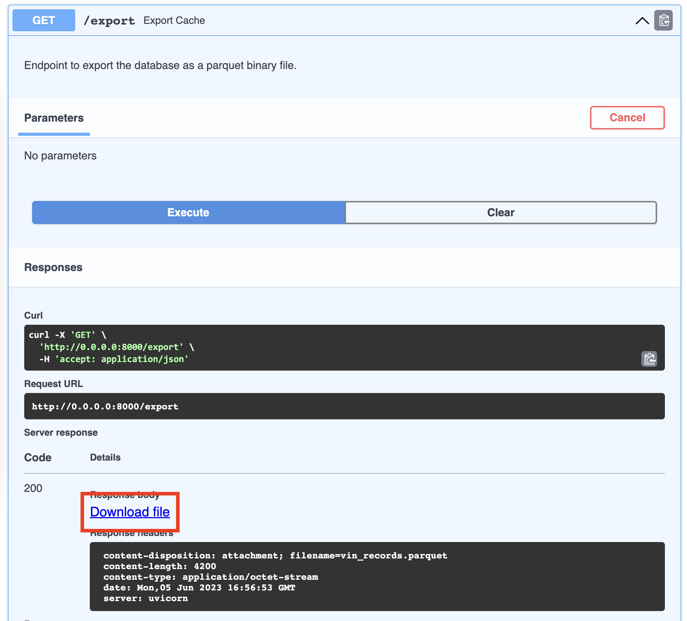

# VIN Decode app

### Prerequsite 
I tested it on **Mac OS** with Python **3.10**, you might need to have the same setup to test out the app.

### python virtual environment setup
```
cd koffie/
python -m venv env && source env/bin/activate && pip install -r requirements.txt
```
### run the program via 
```
uvicorn main:app --reload
```

### How to nagivate and test out 

Open your favorite browser and and visit 0.0.0.0:8000



We can click on the function and validate the funcionality of each endpoint.

Let's use LOOKUP endpoint as an example.

Start with hitting the Try it out button.


Enter your VIN to look up. 


Once we hit the Execute button, the decoded result will appear as response body.



Same testing approach will be applied on REMOVE endpoint.


For the EXPORT endpoint, we can click on the Execute button and Download file link will be available.


